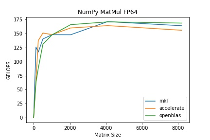
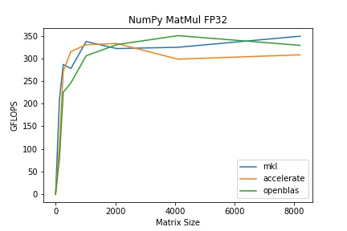
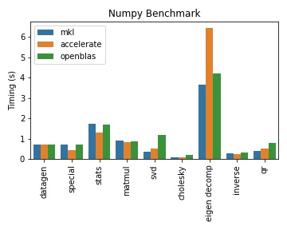

# CSCI-596 Fall 2021 Project

This project is done by Tianjian Huang and Yue (Julien) Yu. In this project, we compare the performance of several off-the-shelf Basic Linear Algebra Subprograms (BLAS): Intel Math Kernel Library (MKL), Apple Accelerate, and Basic Linear Algebra Subprograms (OpenBLAS). BLAS provides common linear algebra operations, such as vector addition, scalar multiplication, dot products, linear combinations, and matrix multiplication. They are no doubt the fundamental building blocks of modern numerical software and machine learning as well. We start from the most basic General Matrix Multiply (GEMM) and move to complicated operations such as matrix factorization. We try to give some performance recommendations and also try to analysis what happened behind the scenes.

## Numpy Benchmarks

We build numpy against three BLAS libraries and perform the following tests:

### GEMM Flops

We use Matmul which is the most fundamental linear algebra operation to measure the GFlops of each BLAS library. The tests have been conducted in FP32 and FP64.

| FP64 | FP32 | 
| ---- | ---- |
|  |  |

### Other Linear Algebra Operations

Time taken for each operation is reported; lower is better. Each opreation has been run for 8 times and the average time is reported.

| NumPy Linear Algebra Performance|
| -------- |
|  |

The conclusions are shown as graphs and are briefly explained as follow:

For the multiplication of two n by n matrices:

• With either 32-bit or 64-bit floating point, GFLOPS converges when n reaches the magnitude of 10e3. Accelerate has slightly lower GFLOPS than the other two.

• When MKL, Accelerate and OpenBLAS are compared across various benchmarks, we notice the following:

    • For easier tasks (special, stats, and even inverse), Accelerate is the fastest.
    
    • For matrix decomposition (SVD, QR), MKL is faster than Accelerate, and OpenBLAS is the slowest.
    
    • For eigenvalue decomposition (i.e., the hardest benchmark), MKL is faster than OpenBLAS, and Accelerate is far slower than the other two.
    
    • MKL's performance dominates that of OpenBLAS.
